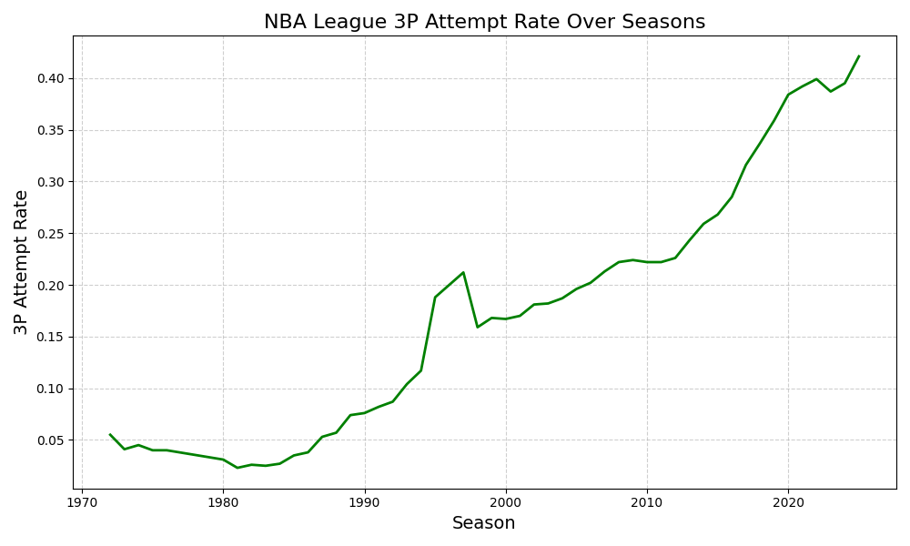
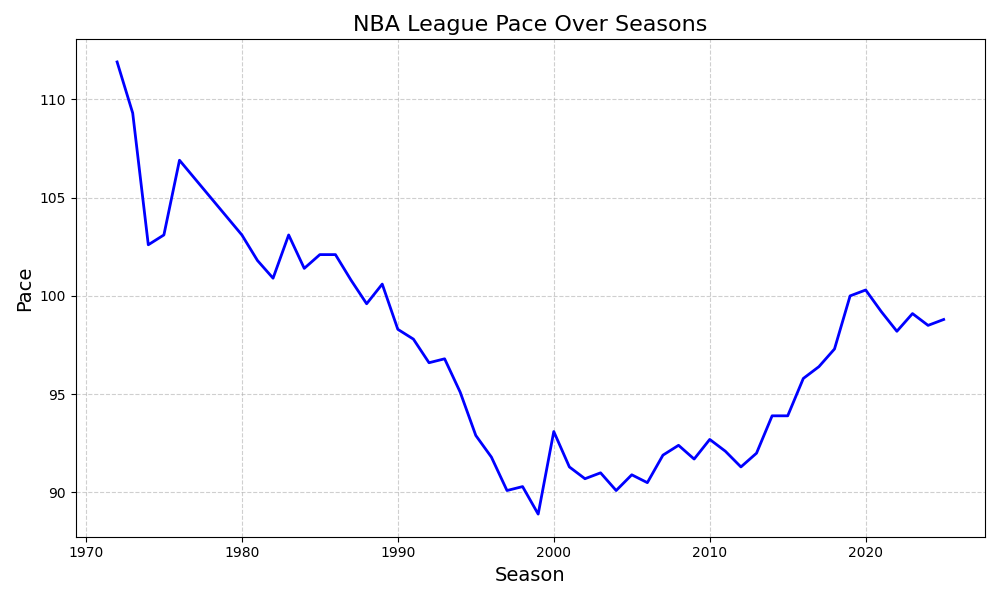

# NBA Historical Data Analysis

## Overview
This project explores NBA historical data from 1947 to 2024. It focuses on player performance, team statistics, and league trends, with an emphasis on 3-point shooting, offensive and defensive metrics, All-Star appearances, and major awards.

### Data Cleaning
  * Used **Python (Pandas)** to clean and preprocess raw NBA datasets.
  * Generated clean, ready-to-analyze CSV files stored in the folder: `cleaned_data_Sets`.
  * This step ensured consistency across player stats, team stats, and All-Star/award datasets before performing analysis and visualization.
## What I Did
- **Player Statistical Analysis**
  - Examined all-time seasons in **3-point shooting, offensive, and defensive metrics**.
  
- **All-Star Analysis**
  - Explored **All-Star selections**, including:
    - Players with the most All-Star appearances.
    - Teams with the most All-Stars in a single season.
    - Average basic stats (points, rebounds, assists) of All-Star players.
  
- **Major Awards Analysis**
  - Investigated **MVP, ROY, DPOY, 6MOY, and clutch player awards**:
    - Counted the players with the most awards.
    - Studied the statistics of MVP winners.
    - Examined the longevity of ROY winners.
  
- **Team Statistics**
  - Analyzed **team stats for NBA champions and other playoff teams**.
  - Calculated averages for champions vs non-champions.
  - Visualized **league-wide trends** using line charts and histograms.

## Tools & Technologies
- Python (Pandas, Matplotlib, Plotly)
- PostgreSQL for data storage and querying
- CSV datasets for NBA player and team statistics

## Data Sources
- NBA player per-game statistics
- Advanced player metrics
- Team summaries
- All-Star selections
- Player award shares

# NBA Historical Stats Results

## Best 3-Point Shooting Seasons

| Player          | Season | Makes | Attempts | Percent | Attempt Rate | True Shooting |
|-----------------|--------|-------|----------|---------|--------------|---------------|
| Stephen Curry   | 2021   | 5.3   | 12.7     | 0.421   | 0.587        | 0.655         |
| Stephen Curry   | 2016   | 5.1   | 11.2     | 0.454   | 0.554        | 0.669         |
| Stephen Curry   | 2019   | 5.1   | 11.7     | 0.437   | 0.604        | 0.641         |
| Stephen Curry   | 2023   | 4.9   | 11.4     | 0.427   | 0.564        | 0.656         |
| Stephen Curry   | 2024   | 4.8   | 11.8     | 0.408   | 0.606        | 0.616         |
| James Harden    | 2019   | 4.8   | 13.2     | 0.368   | 0.539        | 0.616         |
| Stephen Curry   | 2022   | 4.5   | 11.7     | 0.380   | 0.613        | 0.601         |
| Klay Thompson   | 2023   | 4.4   | 10.6     | 0.412   | 0.584        | 0.576         |
| James Harden    | 2020   | 4.4   | 12.4     | 0.355   | 0.557        | 0.626         |
| Stephen Curry   | 2025   | 4.4   | 11.2     | 0.397   | 0.623        | 0.618         |

> Steph Curry appears 7 times in the top 10 — dominating 3-point shooting history.  

**Conclusion:** The evolution of the 3-point shot has transformed NBA scoring, with Curry consistently setting the standard.

---

## Greatest Offensive Seasons

| Player             | Season | Points | Assists | Field Goals | Free Throws | 3PTs | PER  | True Shooting | Win Shares |
|-------------------|--------|--------|---------|------------|------------|------|------|---------------|------------|
| Kareem Abdul-Jabbar| 1972   | 34.8   | 4.6     | 14.29      | 6.2        | 0    | 29.9 | 0.603         | 25.4       |
| Wilt Chamberlain   | 1964   | 36.9   | 5       | 15.04      | 6.8        | 0    | 31.6 | 0.537         | 25.0       |
| Wilt Chamberlain   | 1962   | 50.4   | 2.4     | 19.99      | 10.4       | 0    | 32.1 | 0.536         | 23.1       |
| Kareem Abdul-Jabbar| 1971   | 31.7   | 3.3     | 12.98      | 5.7        | 0    | 29.0 | 0.606         | 22.3       |
| Wilt Chamberlain   | 1967   | 24.1   | 7.8     | 9.70       | 4.8        | 0    | 26.5 | 0.637         | 21.9       |
| Kareem Abdul-Jabbar| 1973   | 30.2   | 5       | 12.91      | 4.3        | 0    | 28.5 | 0.580         | 21.9       |
| Wilt Chamberlain   | 1966   | 33.5   | 5.2     | 13.61      | 6.3        | 0    | 28.3 | 0.547         | 21.4       |
| Michael Jordan     | 1988   | 35.0   | 5.9     | 13.05      | 8.8        | 0.1  | 31.7 | 0.603         | 21.2       |
| Wilt Chamberlain   | 1963   | 44.8   | 3.4     | 18.27      | 8.3        | 0    | 31.8 | 0.550         | 20.9       |
| Oscar Robertson    | 1964   | 31.4   | 11      | 10.63      | 10.1       | 0    | 27.6 | 0.576         | 20.6       |

> Kareem’s 1972 season had the **highest win shares in NBA history** at 35 points per game with 60% true shooting.

**Conclusion:** Dominant scoring seasons were often paired with exceptional efficiency, particularly from centers like Kareem and Chamberlain.

---

## Greatest Defensive Seasons

| Player          | Season | Total Rebounds | Defensive Win Shares |
|-----------------|--------|----------------|--------------------|
| Bill Russell    | 1964   | 24.7           | 16.0               |
| Bill Russell    | 1965   | 24.1           | 14.4               |
| Bill Russell    | 1963   | 23.6           | 12.6               |
| Bill Russell    | 1962   | 23.6           | 11.6               |
| Bill Russell    | 1966   | 22.8           | 11.4               |
| Bill Russell    | 1961   | 23.9           | 11.3               |
| Wilt Chamberlain| 1968   | 23.8           | 10.7               |
| Wilt Chamberlain| 1964   | 22.3           | 10.6               |
| Bill Russell    | 1969   | 19.3           | 9.9                |
| Dave Cowens     | 1973   | 16.2           | 9.9                |

> Bill Russell dominates the top defensive seasons, showing the importance of rebounds and defensive impact before modern tracking metrics.

**Conclusion:** Defensive dominance, particularly rebounding, was a key driver of team success in early NBA history.

# NBA All-Star Selections Results

## Top All-Star Players

| Player       | All-Star Count |
|-------------|----------------|
| LeBron James | 21             |
| Kareem Abdul-Jabbar | 19      |

> LeBron James surpassed Kareem Abdul-Jabbar with **21 All-Star selections** as of 2024.

---

## Teams with Most All-Stars (Recent Years)

| Season | Team | All-Star Count |
|--------|------|----------------|
| 2024   | PHI  | 2              |
| 2023   | MEM  | 2              |
| 2022   | GSW  | 3              |
| 2021   | UTA  | 3              |
| 2020   | MIA  | 2              |

> Philadelphia had the most All-Stars in 2024 with **Joel Embiid** and **Tyrese Maxey**.

---

## Average Stats of All-Stars

| Avg Points | Avg Rebounds | Avg Assists |
|------------|--------------|-------------|
| 20.91      | 7.97         | 4.32        |

**Conclusion:** All-Stars consistently produce strong overall contributions across points, rebounds, and assists.

# NBA Awards & Career Longevity Results

## Total Major NBA Awards

| Player                | Total Awards |
|-----------------------|--------------|
| Kareem Abdul-Jabbar   | 7            |
| Michael Jordan        | 6            |
| LeBron James          | 5            |
| Bill Russell          | 5            |
| Larry Bird            | 4            |

> Kareem Abdul-Jabbar is as decorated as Michael Jordan, with 6 MVPs and 1 ROY. Surprisingly, he never won a DPOY.

---

## Average Stats of Award Winners

| Avg Points | Avg Rebounds | Avg Assists |
|------------|--------------|-------------|
| 25.99      | 12.27        | 5.69        |

**Conclusion:** MVP-level performance requires high scoring, rebounding, and playmaking, reflecting dominance by versatile frontcourt players.

---

## Longevity of NBA ROY Winners

| Player               | NBA Seasons |
|---------------------|-------------|
| LeBron James         | 22          |
| Vince Carter         | 22          |
| Kareem Abdul-Jabbar  | 20          |
| Tim Duncan           | 19          |
| Shaquille O'Neal     | 19          |
| Jason Kidd           | 19          |

**Conclusion:** Early career accolades like ROY often predict long NBA careers.

# NBA Team Stats and Trends

### Champions vs Non-Champions
SQL query used:

```sql
-- Stats of Champions
WITH winners AS (
    SELECT *
    FROM nba_team_stats
    WHERE champions IS TRUE
),
-- Stats of Non-Champions
losers AS (
    SELECT *
    FROM nba_team_stats
    WHERE champions IS FALSE
      AND playoffs IS TRUE
)
````

CSV outputs stored [here](Output%20CSV's). Averages and league trends are included.

---

### Trends Observed

1. **Three-Point Shooting**
   
   The 3PT attempt rate has risen steadily, reflecting a shift toward perimeter offense.

2. **Pace**
   
   Pace has fluctuated over eras: high in the 1970s, lower in the 2000s (isolation-heavy era).

3. **Championship DNA**
   
   Teams with lower defensive ratings tend to win more often than teams with high offensive ratings.

**Conclusion:** Defensive efficiency correlates more strongly with championships than offensive metrics.

---

**Author:** Hans Christopher Barrete
**Date:** 2025

